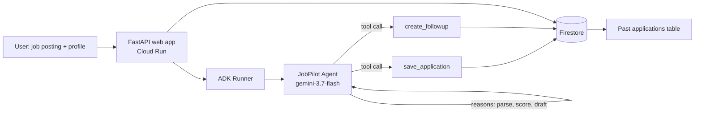

# JobPilot — an autonomous job-application agent

Built for the **All Things Agentic Hackathon** (Taskmaster track).

## The problem

Applying to jobs well is repetitive, multi-step work: read the posting, figure
out what it actually wants, honestly assess your fit, tailor your resume
bullets and cover letter to it, log that you applied, and remember to follow
up. Most people either skip the tailoring (worse odds) or burn an hour per
application (doesn't scale).

## What it does

You give JobPilot **one goal**: a job posting and your profile. It does not
ask follow-up questions — it plans the rest of the workflow itself and
executes it end-to-end:

1. Parses the posting into structured requirements (company, title,
   seniority, must-have / nice-to-have skills).
2. Scores your fit against those requirements (0-100) and lists concrete
   gaps.
3. Drafts 3-5 tailored resume bullet points and a specific, non-generic
   cover letter.
4. Persists the application record via a `save_application` tool call.
5. Schedules a follow-up reminder via a `create_followup` tool call.
6. Returns one final summary — fit score, gaps, materials, follow-up date.

Every past application is visible on the same page, backed by the same
persisted store, so the agent's actions are inspectable, not just a chat
transcript.

## Tech stack

| Requirement | Used |
|---|---|
| Gemini 3.5+ | `gemini-3.7-flash` via the Gemini API (or Vertex AI — see below) |
| Google Agent Framework | [Google ADK](https://github.com/google/adk-python) (`google.adk.Agent`, `Runner`, `InMemorySessionService`) |
| Google Cloud service | Cloud Run (hosting) + Firestore (application persistence) |

## Architecture



The FastAPI app is the only thing deployed to Cloud Run. It hosts a single
HTML page (the demo UI), a `POST /api/run` endpoint that invokes the ADK
`Runner` synchronously and streams back the agent's step log, and a
`GET /api/applications` endpoint that reads persisted records straight from
Firestore.

## Setup

```bash
git clone <this-repo>
cd jobpilot-agent
python -m venv .venv
# Windows: .venv\Scripts\activate   |   macOS/Linux: source .venv/bin/activate
pip install -r requirements.txt

cp .env.example .env
# then edit .env and set GOOGLE_API_KEY (get one free at aistudio.google.com)

python -m uvicorn web.main:app --reload
# open http://localhost:8000
```

Without any Firestore/GCP setup, application records fall back to a local
`.local_store.json` file automatically, so the whole flow is testable with
just a Gemini API key.

## Deploying to Google Cloud

Run from [Cloud Shell](https://shell.cloud.google.com) (has `gcloud`
preinstalled):

```bash
git clone <this-repo> && cd jobpilot-agent
export GCP_PROJECT=your-project-id
export GEMINI_API_KEY=your-gemini-api-key
./deploy.sh
```

This enables the required APIs, provisions a native-mode Firestore database,
and deploys the app to Cloud Run with `gcloud run deploy --source .`.

## What we learned

Orchestrating an LLM agent so it reliably completes a *whole* multi-step
workflow — not just answers one question — means giving it explicit
side-effecting tools (persistence, scheduling) rather than letting it
"talk about" doing them. Verifying the real ADK `Runner`/`Agent` API
signatures against the installed package (rather than trusting
documentation snippets alone) caught a couple of mismatches early and saved
debugging time later.

## Disclosure

This project was built during the hackathon submission period using an AI
coding assistant (Claude Code) for implementation, per the hackathon rules'
allowance for "AI coding assistants." No pre-existing code was incorporated.
